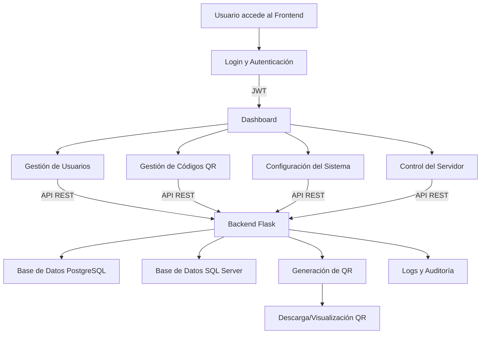

# Manual de Desarrollador

**Desarrollado por:** Ing. Maikel Cuao  
**Email:** maikel@hotmail.com  
**Año:** 2025

## Introducción
SIGA es una aplicación web completa construida con Flask (backend) y React con TypeScript (frontend). El sistema permite la gestión de usuarios con roles y permisos, autenticación segura mediante JWT, y una API RESTful documentada con Swagger. La interfaz de usuario es moderna y utiliza Material-UI.

## Resumen del Funcionamiento por Módulo

### Backend (Flask)
- **app.py**: Punto de entrada principal del backend. Inicializa la aplicación Flask, las extensiones y la configuración.
- **config.py**: Define la configuración del sistema, variables de entorno, conexiones a bases de datos (PostgreSQL local y SQL Server remoto), seguridad, logging y parámetros de producción/desarrollo.
- **models/**: Contiene los modelos de datos (usuarios, roles, configuración, QR, auditoría).
- **routes/**: Define las rutas de la API RESTful:
  - `auth_routes.py`: Autenticación y gestión de sesiones JWT.
  - `user_routes.py`: Gestión de usuarios (CRUD, roles, permisos).
  - `qr_routes.py` y `route_qrdata.py`: Generación, descarga y gestión de códigos QR.
  - `settings_routes.py`: Configuración del sistema y control del servidor.
  - `role_routes.py`: Gestión de roles y permisos.
  - `health_check.py`: Ruta de salud para monitoreo.
- **services/**: Lógica de negocio, especialmente para la generación de QR.
- **utils/**: Funciones auxiliares (conexión a BD, decoradores, helpers).
- **logs/**: Archivos de log rotativos para auditoría y monitoreo.
- **migrations/**: Migraciones de base de datos con Alembic.
- **create_admin.py, initialize_roles.py**: Scripts para inicializar usuarios y roles.
- **server_manager.py, waitress_server.py, windows_service.py**: Gestión del servidor y despliegue en Windows.

### Frontend (React + TypeScript)
- **src/App.tsx**: Componente principal, gestiona rutas y autenticación.
- **src/components/**: Componentes reutilizables (menús, tablas, formularios, estado del servidor, etc.).
- **src/pages/**: Vistas principales (login, dashboard, gestión de QR, configuración, control del servidor).
- **src/api/**: Servicios para consumir la API backend (axios).
- **src/styles/**: Temas y estilos globales.
- **public/**: Archivos estáticos y recursos.

### Scripts y Automatización
- **deployment-scripts/**: Scripts para automatizar la instalación, configuración, backup, monitoreo y despliegue en Windows Server (IIS).
- **.env, .env.production**: Variables de entorno para backend y frontend.

### Base de Datos
- **PostgreSQL (local)**: Usuarios, roles, configuración, QR generados, logs de auditoría.
- **SQL Server (remoto)**: Datos de empleados externos (solo lectura).

## Pasos para la Utilización del Programa

1. **Clonar el proyecto**
   - Descargue o clone el repositorio en su servidor o equipo local.

2. **Configurar el entorno**
   - Configure las variables de entorno en los archivos `.env` (backend) y `.env.production` (frontend) según el entorno (desarrollo o producción).
   - Ejecute los scripts de `deployment-scripts/` para automatizar la configuración si está en Windows Server.

3. **Instalar dependencias**
   - Backend: `pip install -r requirements.txt` (dentro de la carpeta `backend`)
   - Frontend: `npm install` (dentro de la carpeta `frontend`)

4. **Configurar la base de datos**
   - Ejecute las migraciones: `flask db upgrade` (backend)
   - Cree el usuario administrador: `python create_admin.py`
   - Inicialice los roles: `python initialize_roles.py`

5. **Compilar el frontend**
   - Ejecute `npm run build` en la carpeta `frontend` para generar los archivos de producción.

6. **Iniciar los servicios**
   - Backend: `python app.py` o utilice los scripts de despliegue para producción.
   - Frontend: Servir los archivos generados en `dist/` o según la configuración de IIS/Apache.

7. **Acceder a la aplicación**
   - Frontend: http://localhost:8080 (o la URL configurada)
   - API: http://localhost:8080/api o http://localhost:5000 (desarrollo)
   - Documentación API: http://localhost:8080/api/apidocs o http://localhost:5000/apidocs

8. **Uso básico**
   - Inicie sesión con un usuario válido.
   - Gestione usuarios, roles y permisos desde el panel de administración.
   - Genere, descargue y gestione códigos QR desde la sección correspondiente.
   - Configure parámetros del sistema y controle el servidor desde la interfaz web.

9. **Monitoreo y logs**
   - Revise los logs en `backend/logs/` para auditoría y solución de problemas.
   - Utilice los scripts de monitoreo para verificar el estado del sistema.

10. **Backup y restauración**
   - Realice backups periódicos de la base de datos y archivos importantes usando los scripts incluidos.

Consulte la documentación y los scripts de `deployment-scripts/` para tareas avanzadas y automatización.

## Diagrama de Flujo de Funcionamiento

---

## Uso del QR por los Usuarios y Proceso al Escanear

### Funcionamiento real según el código del sistema DINQR

- El administrador genera códigos QR desde la sección de gestión de QR en el panel web.
- Cada QR está vinculado a un funcionario (empleado) y contiene información en formato vCard (nombre, cargo, área, teléfono, email, etc.) o un enlace personalizado, según la opción seleccionada.
- El QR puede ser descargado e impreso desde la plataforma.

**Al escanear el QR:**

1. Si el QR es tipo vCard:
   - El dispositivo móvil reconoce el formato y ofrece guardar el contacto directamente en la agenda del teléfono.
   - Los datos incluidos son los que aparecen en la ficha del funcionario: nombre, función, área, organización, teléfono y email.

2. Si el QR es tipo URL:
   - El navegador accede a la URL codificada, que puede ser una página de perfil, validación o información adicional (según configuración del sistema).

3. En ambos casos, el sistema puede registrar el evento de generación y descarga del QR, pero actualmente no registra el escaneo en tiempo real (esto se puede ampliar en el backend si se requiere auditoría de escaneos).

**Notas técnicas:**
- El endpoint `/qr/funcionarios` y los servicios relacionados gestionan la generación y descarga de los QR.
- El método `generar_vcard(datos)` en el backend construye el contenido vCard para el QR.
- El frontend permite filtrar, generar y descargar los QR de los funcionarios desde la sección correspondiente.

> Para modificar el comportamiento del QR (por ejemplo, registrar escaneos o cambiar el formato), se debe ajustar la lógica en los archivos `route_qrdata.py`, `qr_service.py` y los componentes de React relacionados con la gestión de QR.

---

Este manual resume la arquitectura y funcionamiento de DINQR, facilitando la comprensión y el mantenimiento para nuevos desarrolladores.
